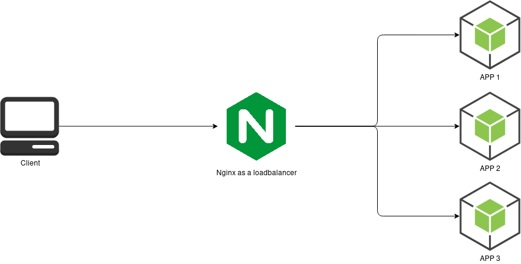

<!-- @format -->

# Layer 4 & layer 7 proxy with Nginx

> using Nginx

## Usage

1. clone the repo
2. use `docke build -t nginxproxy .` to build the image
3. use `docker run -t -p 8888:8080 nginxproxy`
4. go to http://localhost:8888

## Diagram

  

