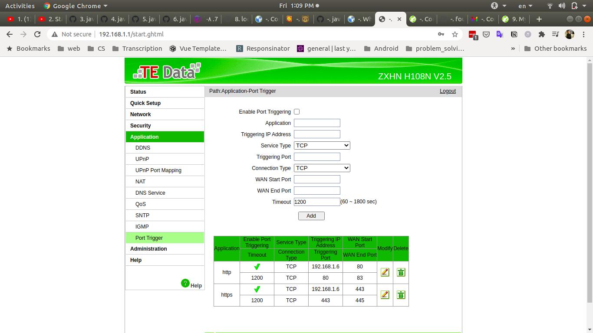
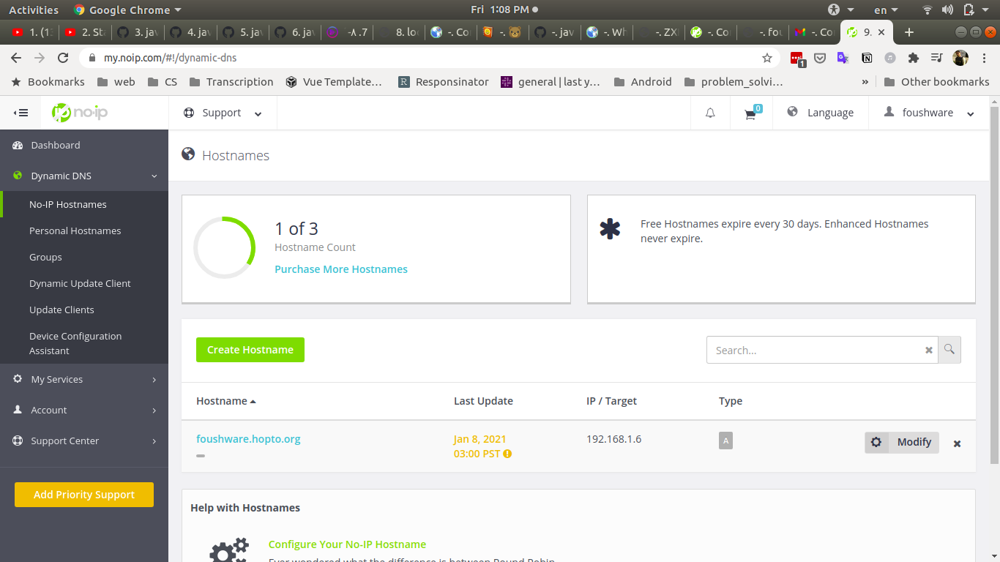
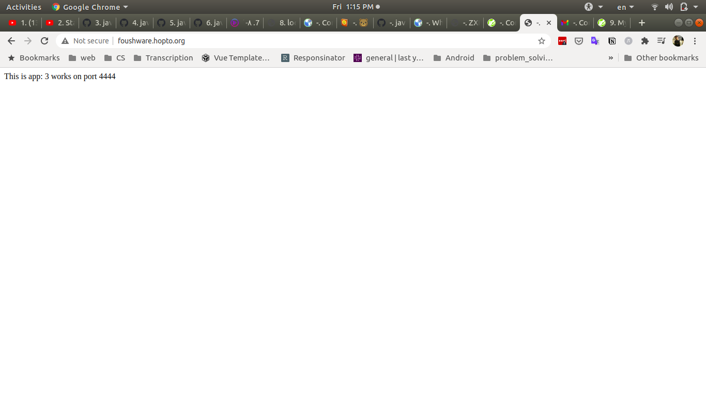

<!-- @format -->

# Layer 4 & layer 7 proxy with Nginx

> using Nginx

## Usage

1. clone the repo
2. use `docker-composer build ` to build the images
3. use `docker-composer up `
4. go to http://localhost:8080

## Diagram

  

## Create DNS Record

- Port forwarding

  

- DNS_With_noip

  

- DNS works

  

